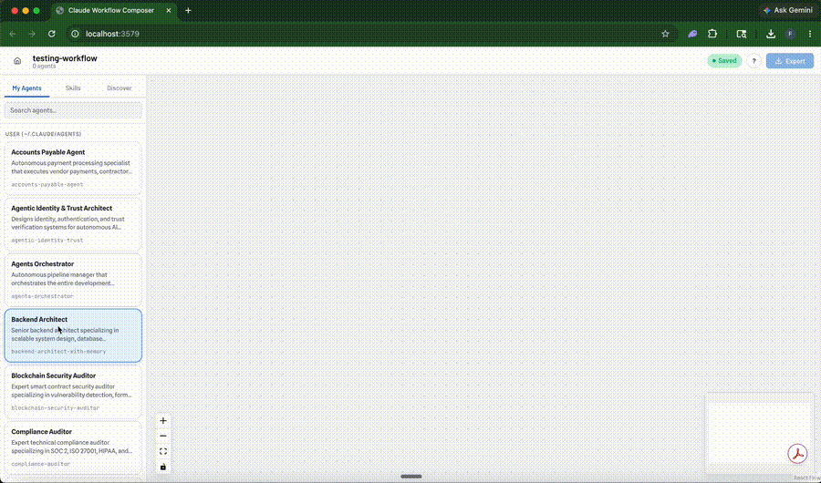

# Claude Workflow Composer

[](https://github.com/fayzan123/claude-workflow-composer/actions/workflows/ci.yml)

**Find the work you keep repeating in Claude Code — and turn it into runnable workflows.** CWC scans your local Claude Code history, surfaces the tasks you do by hand again and again, and generates a multi-agent workflow you can run, schedule, and monitor. When you want to build one by hand, there's a visual canvas for that too.



---

## Start here: scan your history

Run `npx claude-cwc`, then click **Scan my history** on the dashboard. CWC reads your Claude Code sessions, clusters the work you repeat, and offers the strongest candidates as one-click workflows. The visual canvas (below) is there when you want to compose or refine one yourself.

## The Problem

Building multi-agent workflows in Claude Code today means:

1. Hand-writing agent `.md` files with YAML frontmatter
2. Manually authoring orchestrator skills with `disable-model-invocation: true` and sequenced handoff prose
3. No visual representation of the pipeline before running it
4. No way to share a complete, working workflow with someone else
5. No way to discover what good pipelines look like

The authoring experience is entirely text-based. You can't see what you're building until you run it.

---

## Quick Start

```bash
npx claude-cwc
```

Opens a browser at `http://localhost:3579`. The local server binds to loopback and protects API calls with a per-run local token.

Use **Detect automations** from the Home dashboard to scan your local Claude Code history, find repeated work, and generate a ready-to-edit workflow from the strongest candidates.

On first run, CWC may offer to install an optional Claude Code skill at `~/.claude/skills/cwc-generate-workflow/SKILL.md`. That skill lets you ask Claude Code to generate a `.cwc` workflow from plain English. Remove it with:

```bash
npx claude-cwc uninstall-skill
```

```bash
npx claude-cwc stop    # Stop the server
```

On macOS, install the background service if you want scheduled automations to keep running after reboot:

```bash
npx claude-cwc install-service
npx claude-cwc uninstall-service
```

### Troubleshooting: Detect fails or finds nothing

If a history scan errors out or reports no automations when you expect some, run the offline health check:

```bash
npx claude-cwc doctor --bundle
```

It checks your environment (Claude binary, transcript discovery, per-file parsing) without invoking Claude, prints a verdict, and writes `cwc-doctor-bundle.json`. The bundle is redacted — it contains counts, versions, entry-type tallies, and project folder names, never your prompts, commands, or conversation content — so it's safe to attach to a [GitHub issue](https://github.com/fayzan123/claude-workflow-composer/issues). After a failed in-app scan, the same diagnostics are available at `http://localhost:3579/api/automation-scan/diagnostics`.

Or from source:

```bash
npm run build && npm start
```

---

## How It Works

```
Drag agents onto a canvas
  → Connect them with handoff arrows (author trigger conditions)
  → Edit each agent's system prompt, tools, skills, and completion criteria
  → Add schedules/webhooks in Automate mode when the workflow should run itself
  → Preview every file that will be written before exporting
  → Export → writes agent .md files + orchestrator SKILL.md to ~/.claude/ or project .claude/
  → Invoke the workflow as /cwc-<workflow-slug> in Claude Code
```

The exporter writes directly to `~/.claude/` (user-scoped) or `.claude/` inside any project directory (project-scoped, version-controllable). Conflict detection ensures it never touches files it doesn't own.

### Build

Drag an **existing agent** from the sidebar (`~/.claude/agents/` or project `.claude/agents/`) onto the canvas to create a **reference node** — it points to that agent file by slug rather than duplicating it. Drag **New Agent** to create a **bespoke node** — the exporter generates a new agent file for it. Drag **Approval Gate** to add a human checkpoint.

Connect nodes by dragging between handles. Each connection becomes a **handoff** with a trigger description and optional context artifacts (files, text, JSON) passed between agents. Mark any node as a **terminal** (`Complete`, `Escalated`, or `Aborted`) to define workflow end states.

Edit any node's completion criteria, tool access, skills, and system prompt in the **Node Panel**. The first node can also have a **start trigger** describing what initiates the workflow.

Real-time validation surfaces duplicate slugs, empty names, disconnected nodes, and missing completion criteria in the workflow header before you export.

Use **Generate agent** or **Generate skill** in the sidebar to draft reusable Claude Code assets from a plain-English description. CWC gives you an editable spec first, then writes the file into `~/.claude/agents/` or `~/.claude/skills/`. The **Discover** sidebar tab links to community agent and skill repositories.

### Export

Click **Export** in the workflow header. Choose a target directory (`~/.claude/` or any project's `.claude/`). Review a **preview** of every file that will be written. Confirm to write.

The exporter:

- **Bespoke nodes** → writes an agent `.md` file with frontmatter (name, description, color, model, tools), system prompt, completion criteria, skill references, and an ownership comment.
- **Reference nodes** → writes nothing — the `exportedSlug` is set to the existing agent's slug so the orchestrator routes to it directly.
- **Workflow skill** → generates an orchestrator skill at `.claude/skills/cwc-<workflow-slug>/SKILL.md`. By default it includes `disable-model-invocation: true`; the export modal can opt a single workflow into autonomous Claude invocation outside CWC's isolated-run harness. The orchestrator body is produced by BFS-traversing the node/edge graph into natural-language steps.
- **Rename handling** → if a node was renamed, the old owned file is deleted and the new one is written.
- **Conflict detection** → every file carries an ownership HTML comment. Before overwriting or deleting, the exporter verifies ownership — it never touches files created by other workflows or by hand.

### Run

From any Claude Code session, invoke the workflow by its skill name:

```
/cwc-workflow-name
```

The orchestrator skill delegates every implementation step to sub-agents via the Agent tool. Each step references an agent by name; Claude Code resolves it to the agent's `.md` file and loads its system prompt, tools, and completion criteria.

You can also use **Test run** from CWC after exporting. Test runs spawn Claude Code headlessly with `--permission-mode bypassPermissions`, use a chosen working directory, and can run in a git worktree or in-place.

### Automate

Open a workflow's **Automate** mode to add schedules and webhooks:

- **Cron** — use the schedule builder or enter a custom cron expression (e.g. `0 9 * * 1-5` for weekdays at 9 am).
- **Webhook** — CWC generates an inbound local URL (`POST http://localhost:3579/api/triggers/<token>`) to fire the workflow.
- **Working directory / targets** — choose where the automation runs, including optional additional repos for fan-out.
- **Isolation** — use a git worktree for an isolated branch, or run in-place when you explicitly want the current checkout.
- **Precondition** — a shell command that must succeed before CWC starts the run.
- **Setup command** — a shell command CWC runs after the run starts, before Claude begins.

Add a **gate node** (drag from the "Gate" section of the sidebar) at any point in the workflow. When the run reaches a gate it:
1. Commits all changes to a `cwc/<runId>` branch and pauses.
2. Posts a diff of the working branch to the approval inbox in Runs mode and on the Home dashboard.
3. Waits — the reviewer reads the diff, writes an optional note, and clicks **Approve** or **Reject**.
4. On approval, the run resumes in the same Claude Code session from the gate point.

The Home dashboard has an **Automations** widget that globally pauses or resumes scheduled/webhook runs without deleting or disarming triggers. Runs mode shows live/history timelines, approval inbox items, diffs, a stop button for active CWC-managed runs, and notification settings (macOS banners and/or a webhook URL).

### Detect

Click **Detect automations** on the Home dashboard to scan your local Claude Code history for repeated work. CWC parses local transcript files, builds compact digests, asks Claude to cluster recurring tasks, and shows candidates with evidence, confidence, observed steps, and a suggested trigger.

Click **Generate workflow** on a candidate to promote it into a real `.cwc` workflow. CWC looks for matching local skills and existing agents, asks Claude to compose the workflow, validates the generated graph, seeds disabled schedule triggers when appropriate, and opens the workflow for review.

### Delete

`POST /api/export/delete` scans every exported file, checks its ownership comment, and only removes files owned by the current workflow. Reference nodes have nothing to delete — they didn't write any files.

---

## Features

- **Visual canvas** — React Flow with background grid, minimap, zoom controls, and drag-to-connect
- **Theme toggle** — switch between light and dark mode from the Home dashboard or workflow header
- **Left sidebar** — My Agents (searchable, draggable from user/project `.claude/agents/`), Skills (searchable, draggable onto selected nodes), and Discover links for community assets
- **Generate agent / skill** — draft new reusable Claude Code assets from plain English, refine the spec, then save to `~/.claude/`
- **Right panels** — Node Editor (name, description, criteria, tools, skills, system prompt, terminal type) and Edge Editor (trigger, label, context artifacts)
- **Export modal** — target selection, full file preview, warning display before writing anything
- **Auto-save** — 500ms debounced save to `~/.cwc/workflows/`, no manual saving needed
- **Saved workflows** — home screen lists `.cwc` files from `~/.cwc/workflows/`; opened paths are also tracked in `~/.cwc/recents.json`
- **Markdown preview** — click any agent or skill card to view its source file
- **Open in editor** — view any agent or skill file in your system editor
- **Claude Code detection** — warns on startup if `~/.claude/` is missing
- **Test run** — launch an exported workflow headlessly from the UI (`--permission-mode bypassPermissions`, user-chosen working directory, worktree or in-place isolation) and stop it mid-run
- **Live run view** — the active node pulses on the canvas, completed nodes get a check, and events stream into a timeline panel
- **Run history** — runs of exported workflows with run logging enabled persist to `~/.cwc/runs/` with status, duration, source, and cost
- **Automate mode** — attach cron schedules or webhook URLs to a workflow, choose targets/isolation, add preconditions/setup commands, and arm trusted triggers
- **Approval gates** — insert a gate node into any workflow; when reached the run pauses and posts a diff of its working branch, a reviewer approves or rejects from the inbox (or terminal), the run resumes on the same session
- **Isolated runs** — Test Run (and scheduler-fired runs) create a git worktree on a `cwc/<runId>` branch so the main checkout is always untouched; the worktree is removed after the run completes
- **Notifications** — macOS banner + optional webhook on run complete, gate pause, and approval request; configured from Runs mode
- **Global pause** — one Home dashboard toggle suspends all scheduled and webhook automation runs without disarming triggers
- **Detect automations** — scans local Claude Code transcripts, clusters repeated work, streams progress, suggests automations, and promotes a candidate into a `.cwc` workflow with matching skills/agents reused when possible

---

## Architecture

```
Client (React + React Flow)             Server (Express :3579)
┌──────────────────────────────┐        ┌─────────────────────────────┐
│ HomeDashboard                 │ ────► │ /api/workflows              │
│ DetectView + DetectHero       │ ◄───► │ /api/automation-scan (+SSE) │
│ WorkflowView + WorkflowHeader │ ────► │ /api/recents                │
│ BuildMode                     │ ────► │ /api/agents                 │
│   Sidebar                     │ ────► │ /api/skills                 │
│   Canvas (React Flow)         │ ────► │ /api/agents/generate        │
│   StepDrawer                  │ ────► │ /api/skills/generate        │
│   OrchestratorPreview         │ ────► │ /api/export/preview         │
│ RunsMode                      │ ◄───► │ /api/runs (+SSE)            │
│ AutomateMode                  │ ────► │ /api/automations            │
│ RunModal                      │ ────► │ /api/triggers               │
│ ExportFlow                    │ ────► │ /api/export                 │
│ useWorkflow/useAutoSave       │ ────► │ /api/export/delete          │
└──────────────────────────────┘        │ /api/exported-workflows     │
                                        │ /api/file-content           │
                                        │ /api/open-file              │
                                        │ /api/service-status         │
                                        │ /api/claude-check           │
                                        │ /api/health                 │
                                        └─────────────────────────────┘

Core library:
  schema.ts                 Canonical .cwc types
  slugify.ts                Shared slug normalization
  run-events.ts             Run event schema and validation
  workflow/bfs.ts           Graph traversal
  workflow/prose-generator.ts
                            Orchestrator prose generation
  export/exporter.ts        Export orchestration, slug reconciliation, conflict checks
  export/file-writer.ts     Agent and workflow skill Markdown output
  export/conflict-detector.ts
                            Ownership-comment detection
  export/skill-resolver.ts  User/plugin skill lookup
  detection/*               Claude Code transcript parsing, digesting, analysis
  generation/*              Native automation-to-workflow planning and compilation

Server modules:
  security.ts               API token cookie, auth middleware, CORS rules
  launcher.ts               CLI/server launch and port-collision handling
  run-store.ts              JSONL run persistence and SSE fan-out
  workflow-runner.ts        Headless Claude Code process spawning
  run-isolation.ts          Git worktree creation, cleanup, and diff helpers
  run-launcher.ts           Test/scheduled/webhook run lifecycle
  automation-state.ts       Trigger arm/pause/fire bookkeeping
  automation-scheduler.ts   Cron trigger evaluation
  trigger-targets.ts        Target repo fan-out resolution
  scan-store.ts             Detection scan/promotion state
  streaming-analyzer.ts     Streaming Claude analysis runner
  notifier.ts               macOS and webhook notifications
  config.ts                 Notification config persistence

Storage:
  ~/.cwc/
    recents.json              Recent file paths (max 10)
    workflows/                Saved .cwc workflow files
    runs/<workflowId>/        Run event logs (one .jsonl per run)
    worktrees/                Git worktrees for isolated runs (auto-cleaned)
    automation-state.json     Global pause flag + per-trigger arm state
    automation-scan.json      Latest history scan, suggestions, promotion state, and logs
    config.json               Notification settings (macos, webhookUrl)
    server.pid                PID of running server
  ~/.claude/
    agents/*.md               Agent definitions (read + written)
    skills/*/SKILL.md         User skills (read by sidebar)
    plugins/cache/...         Plugin skills (read by sidebar)
```

---

## Key Concepts

| Concept                | Description                                                                                                  |
| ---------------------- | ------------------------------------------------------------------------------------------------------------ |
| **CwcFile**            | JSON file format (`.cwc`) representing a full workflow: metadata, nodes, edges                               |
| **Bespoke node**       | A node whose agent definition is authored in the UI — exporter writes a new `.md` file                       |
| **Reference node**     | A node with an `agentRef` slug pointing to an existing agent on disk — exporter writes nothing               |
| **Handoff**            | A directed edge with a trigger description and optional context artifacts                                    |
| **Terminal edge**      | An edge with no target node — marks a workflow end state (complete/escalated/aborted)                        |
| **Ownership comment**  | HTML comment appended to every exported file: `<!-- cwc:node:<id>:workflow:<id> -->`                         |
| **Orchestrator skill** | The workflow skill generated at `.claude/skills/cwc-<workflow-slug>/SKILL.md` — a Claude Code skill that delegates via Agent tool |
| **Conflict detection** | Reads the ownership comment from a file on disk to determine if this workflow can safely overwrite/delete it |
| **Gate node**          | A `nodeType: 'gate'` node that pauses a run at a checkpoint, diffs the branch, and waits for approval       |
| **Trigger**            | A cron or webhook definition stored in workflow metadata; the scheduler/webhook router fires armed, enabled triggers |
| **Isolation**          | Worktree mode creates a `cwc/<runId>` branch so the main checkout is never modified by an automated run     |
| **Model invocation**   | Per-workflow export option. Off keeps `disable-model-invocation: true`; auto omits it so Claude may invoke the workflow outside CWC's run harness |
| **Detection scan**     | Local Claude Code history analysis that clusters repeated tasks and can promote a candidate into a `.cwc` workflow |

---

## Why Open Source

This tool has filesystem access to `~/.claude/`. Open source is the trust model: there is no CWC-hosted backend, and the local Node.js server is the entire app backend. The server binds to `127.0.0.1`, restricts cross-origin API access, and protects packaged-app API requests with a per-run local token.

---

## Development

This project uses npm and `package-lock.json`. `package.json` declares Node `>=18`; CI runs Node 20 and 22 on Ubuntu and Windows.

```bash
npm run dev:server          # Watch-mode TypeScript compilation to dist/
npm run dev:api             # Local API at :3579 with CWC_DISABLE_AUTH=1
npm run dev:client          # Vite dev server with HMR (port 5173, proxies /api to :3579)
npm test                    # Run all tests (Vitest)
npm run typecheck           # Type-check server + client
npm run build               # Production build (server + client + bundled skill)
npm start                   # Run the built CLI/server from dist/
```

For local development, run `dev:server`, `dev:api`, and `dev:client` in separate terminals. `dev:api` intentionally disables packaged-app API auth so Vite can talk to the server; do not carry that behavior into packaged mode.

Durable coding-agent guidance lives in `AGENTS.md`; Claude Code-specific guidance lives in `CLAUDE.md`. Keep them in sync when changing repo conventions.

### Tests

The Vitest suite covers:

- **BFS traversal**: linear chains, back-edges, fan-out, multi-root, terminal edges
- **Prose generation**: start triggers, bold wrapping, context artifacts, Oxford comma, back-edge ordering
- **File writer**: frontmatter, skills block, ownership comments, workflow skill generation
- **Exporter**: full integration with real temp filesystem, rename cleanup, skill resolution, re-export, hard conflict failures for foreign or hand-authored files
- **Validation**: empty workflows, missing names, duplicate slugs, disconnected nodes
- **Graph layout**: horizontal spacing, fan-out vertical spacing, back-edge stability
- **HTTP endpoints**: all API routes tested with real server instances
- **Slugify**: special chars, truncation, hyphen collapse, empty input
- **Conflict detection**: owned, foreign, absent, malformed states
- **Server hardening**: local API token enforcement, workflow path confinement, export target path validation
- **Skill resolution**: namespaced (plugin) and non-namespaced (user) skill lookup
- **Claude runner**: binary resolution (incl. Windows shims), stdin prompt delivery, timeout/error envelopes
- **Undo history**: coalescing, redo-stack clearing, edge cascade on node delete, history cap
- **Run isolation**: worktree create/remove, diff generation, git detection
- **Run launcher**: fireWorkflow lifecycle, worktree + in-place paths, classifyAndFinish
- **Automation scheduler**: cron firing, precondition checks, daily cap, global pause gate
- **Automation state**: arm/disarm, paused flag persistence, trigger hashing
- **Gate endpoints**: approve (resume), reject, 409 on wrong state, diff response
- **Notifier**: macOS toast, webhook POST, event filtering
- **Automation detection**: transcript parsing, digest building, analysis parsing, streamed scan logs, model allowlist, promote/cancel workflow generation, and trigger seeding
- **Help copy and theme preference**: glossary terms, control hints, light/dark theme parsing, and dashboard event helpers

---

## Contributing

PRs welcome. The codebase is TypeScript end-to-end (client + server + core library). Run `npm test` and `npm run typecheck` before submitting.

If you build a workflow you're proud of, share the `.cwc` file — that's how the community library grows.

---

## License

MIT
